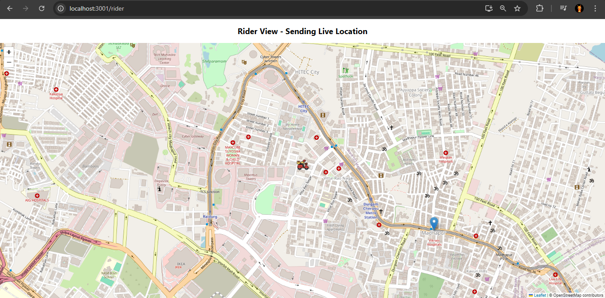
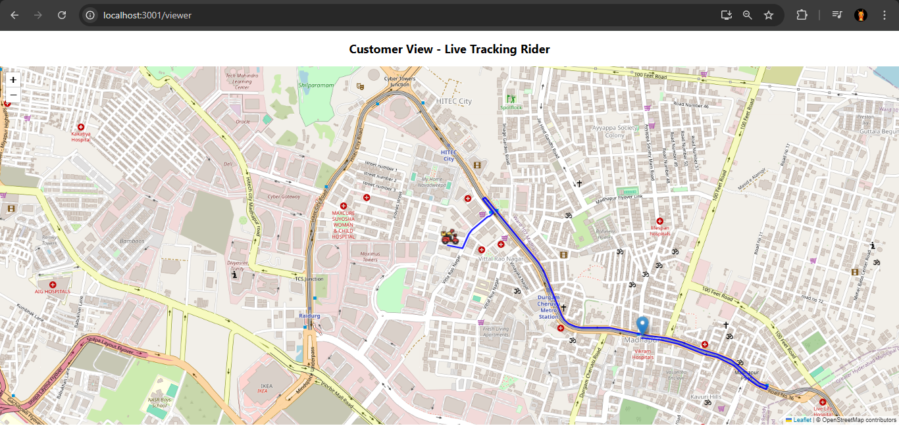

# Rider Tracking Kafka

Rider Tracking Kafka is an Uber-like real-time rider tracking system.
It simulates a rider's live movement, streams location updates using Kafka, and shows the rider position in a customer-facing live map view.

## What This Project Is

- A real-time rider tracking platform inspired by apps like Uber.
- The rider app continuously sends location updates.
- Kafka is used as the event-streaming backbone between producer and consumers.
- The viewer app receives updates through WebSocket/STOMP and visualizes live rider movement on the map.
- The system can also trigger emergency deviation alerts and supports Kafka-driven email notifications.

## Features

- **Live rider location publishing** from rider UI to backend REST API.
- **Kafka-based streaming** for rider location events (`rider-location` topic).
- **Real-time viewer tracking** using Spring WebSocket + STOMP (`/topic/location`).
- **Emergency alert detection** when rider deviates beyond configured distance (`/topic/alerts`).
- **Route rendering** between rider and destination using OpenRouteService + Leaflet maps.
- **Kafka-based email pipeline** through `email-topic` with retry logic in consumer.
- **Separate rider and viewer routes**:
  - Rider page: `http://localhost:3000/rider`
  - Viewer page: `http://localhost:3000/viewer`

### Feature Snapshots





## Tech Stack

### Frontend

- React (Create React App)
- React Router
- Leaflet + React Leaflet
- SockJS + STOMPJS
- Axios

### Backend

- Java 21
- Spring Boot
- Spring Web
- Spring Kafka
- Spring WebSocket
- Spring Mail
- Maven

### Messaging and Realtime

- Apache Kafka
- STOMP over SockJS WebSocket

## Project Structure

- `frontend/` - React app (rider and viewer UI)
- `backend/` - Spring Boot Kafka/WebSocket/Mail service
- `attachement1.png`, `attachement2.png` - project feature screenshots

## How To Start The App

## 1) Prerequisites

- Node.js and npm
- Java 21
- Maven (or use Maven Wrapper already included)
- Apache Kafka (with Zookeeper if your Kafka setup requires it)

## 2) Start Kafka

Start Zookeeper and Kafka broker on default ports (especially `9092`), then keep them running.

If you use local Kafka scripts, run the equivalent of:

- Start Zookeeper
- Start Kafka broker

Make sure backend can connect to:

- `spring.kafka.bootstrap-servers=localhost:9092`

## 3) Run Backend (Spring Boot)

From the `backend` folder:

```bash
./mvnw spring-boot:run
```

On Windows PowerShell, you can use:

```powershell
.\mvnw.cmd spring-boot:run
```

Backend runs on:

- `http://localhost:8084`

## 4) Run Frontend (React)

From the `frontend` folder:

```bash
npm install
npm start
```

Frontend runs on:

- `http://localhost:3000`

## 5) Open The App

- Rider simulation view: `http://localhost:3000/rider`
- Viewer tracking view: `http://localhost:3000/viewer`

## Optional API Endpoints

- Send rider location to Kafka:
  - `POST http://localhost:8084/api/location`
- Send email payload to Kafka:
  - `POST http://localhost:8084/api/mail`

---

If you plan to publish this repository publicly, move API keys and email credentials to environment variables or config files that are not committed.
